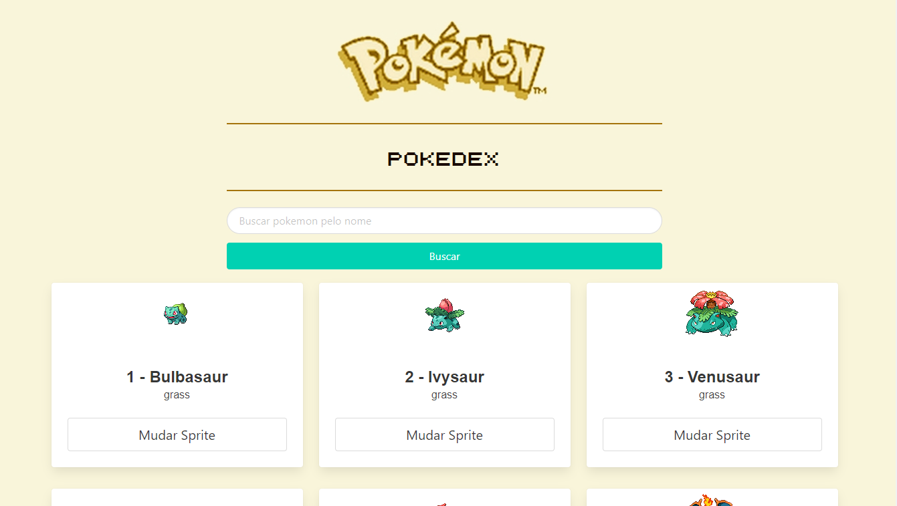

<h1 align="center">
	
  <br>
</h1>
<h3 align="center">
  POKEDEX
</h3>

<p align="center">
  

  <a href="https://www.linkedin.com/in/eliasgcf/">
    
  </a>

  

  <a href="https://github.com/EliasGcf/readme-template/commits/master">
    
  </a>

</p>

<p align="center">
  <a href="#-sobre-o-projeto">Sobre o projeto</a>&nbsp;&nbsp;&nbsp;|&nbsp;&nbsp;&nbsp;
  <a href="#-visual">Desktop</a>&nbsp;&nbsp;&nbsp;|&nbsp;&nbsp;&nbsp;
  <a href="#-deploy">Deploy</a>&nbsp;&nbsp;&nbsp;|&nbsp;&nbsp;&nbsp;

  <a href="#-tecnologias">Tecnologias utilizadas</a>&nbsp;&nbsp;&nbsp;|&nbsp;&nbsp;&nbsp;
  <a href="#-instalação">Instalação</a>&nbsp;&nbsp;&nbsp;|&nbsp;&nbsp;&nbsp;
</p>
 
## 👨🏻‍💻 Sobre o projeto

- <p style="color: red;">Pokedex criada com Vuejs utilizando a <a href="https://pokeapi.co/">PokeAPI</a> na Formação Nodejs</p>


## 💻 Visual




## 🚀 Deploy 

O site está hospedado no [Vercel](https://vercel.com/dashboard) -> [Pokedex](https://pokedex-three-delta.vercel.app/)

## 🛠 Tecnologias

- [Vue](https://vuejs.org/)
- [Axios](https://github.com/axios/axios)
- [Bulma](https://bulma.io/)


## 💻 Instalação

### Requisitos

- [Node.js](https://nodejs.org/en/)
- [Yarn](https://classic.yarnpkg.com/) ou [npm](https://www.npmjs.com/)

**Clone o projeto e acesse a pasta**

```bash
$ git clone https://github.com/ggibamede/Pokedex.git && cd Pokedex
```

**Siga as seguintes etapas**

```bash
# Instale as dependencias
$ npm install 
# Inicie o projeto
$ npm run serve
# Acesse o navegador na rota http://localhost:8080/
```
